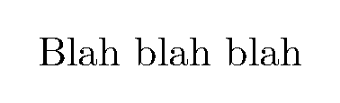

# Notes on Latex

## Contents

- [Notes on Latex](#notes-on-latex)
  - [Contents](#contents)
  - [Installation](#installation)
  - [Useful links](#useful-links)
  - [Document template](#document-template)
  - [Compiling a PDF](#compiling-a-pdf)
  - [Compiling to PNG](#compiling-to-png)
  - [Description of packages](#description-of-packages)
  - [`.gitignore`](#gitignore)
  - [Changing document style for a particular publication](#changing-document-style-for-a-particular-publication)
  - [Maths formatting](#maths-formatting)
    - [Underset text](#underset-text)
  - [Text formatting](#text-formatting)
    - [Use a fixed width font](#use-a-fixed-width-font)

## Installation

Two major distributions of Latex are [TeX Live](https://www.tug.org/texlive/) and [MiKTeX](https://miktex.org/download). [Overleaf appears to suggest MiKTeX for Windows](https://www.overleaf.com/learn/latex/Choosing_a_LaTeX_Compiler#TeX_distributions), however [this Stack Overflow answer states that MiKTeX is susceptible to simple viruses](https://tex.stackexchange.com/a/20415/266921), and TeX Live is also [strongly recommended](https://github.com/James-Yu/LaTeX-Workshop/wiki/Install#requirements) by the [Visual Studio Code LaTeX Workshop Extension](https://github.com/James-Yu/LaTeX-Workshop) (which I am using to automate compiling LaTeX documents into PDF), so I decided to go with TeX Live, which can be downloaded from [here](https://www.tug.org/texlive/).

## Useful links

- ["Learn LaTeX in 30 minutes" on Overleaf](https://www.overleaf.com/learn/latex/Learn_LaTeX_in_30_minutes)
- [CodeCogs equation editor (generates links to equations)](https://editor.codecogs.com/)
  - [Alternative CodeCogs equation editor](https://latex.codecogs.com/eqneditor/editor.php)

## Document template

The following is a sensible, minimal example of a document template for a `tex` document. It assumes:

- Sections are contained in dedicated `tex` files in a subdirectory called `Sections`
- Images are contained in a parallel directory called `Results`
- References are contained in a file in the current directory called `references.bib`

```latex
\documentclass{article}

\usepackage[a4paper, total={7in, 10in}]{geometry}

\usepackage{hyperref}
\usepackage{amsmath}
\usepackage{amsfonts}
\usepackage{subcaption}
\usepackage{parskip}
\usepackage{xcolor}
\usepackage{graphicx}
\graphicspath{{../Results/}}

\title{
    Main document title \\
    \large Document subtitle
}
\author{Jake Levi \\ University of Oxford}
\date{June 2023}

\begin{document}

\maketitle

\section{Introduction} \label{section:intro}
\input{Sections/Intro.tex}

\section{Related work}
\input{Sections/related_work.tex}

\section{Methods}
\input{Sections/methods.tex}

\section{Results}
\input{Sections/results.tex}

\section{Discussion}
\input{Sections/discussion.tex}

\bibliographystyle{plain}
\bibliography{references}

\appendix

\section{Additional results}\label{appendix:additional results}
\input{Sections/additional_results.tex}

\end{document}
```

## Compiling a PDF

If the above template is saved in a file called `report.tex`, and all the files that it includes exist and are valid `tex` files, then a PDF of the document can be created simply by saving the document in a VS Code window with the [Visual Studio Code LaTeX Workshop Extension](https://github.com/James-Yu/LaTeX-Workshop) installed.

Inspecting the `LaTeX Compiler` option of the VS Code `Output` pane reveals that the command performed when saving the document in VS Code is equivalent to performing the following command in a terminal open in the directory containing `report.tex`:

```
pdflatex -synctex=1 -interaction=nonstopmode -file-line-error -recorder  report.tex
```

Descriptions can be found online for the meanings of [`-file-line-error` and `-recorder`](https://linux.die.net/man/1/pdflatex), [`-synctex=1`](https://tex.stackexchange.com/a/118491/266921) and [-interaction=nonstopmode](https://tex.stackexchange.com/a/258816/266921).

## Compiling to PNG

Sometimes it is desirable to compile to an image (instead of a PDF), for example to produce an easily shareable [MRE](https://en.wikipedia.org/wiki/Minimal_reproducible_example) of some Latex code. This can be achieved using the `standalone` package (whose [documentation is available online](http://mirrors.ibiblio.org/CTAN/macros/latex/contrib/standalone/standalone.pdf)), for example:

```tex
\documentclass[11pt, border=10pt]{standalone}
\begin{document}
Blah blah blah
\end{document}
```

After building the above LaTeX file into a PDF, the resulting PDF can be converted to a PNG image file with Tex Live on Windows using the following `powershell` commands (assuming the above Tex code is saved in a file called `mini.tex`, and the terminal is open in the same directory as `mini.tex`):

```powershell
$env:GS_LIB="C:/texlive/2022/tlpkg/tlgs/Resource/Init;C:/texlive/2022/tlpkg/tlgs/lib;C:/texlive/2022/tlpkg/tlgs/kanji"
C:/texlive/2022/tlpkg/tlgs/bin/gswin32c.exe -dSAFER -dBATCH -dNOPAUSE -sDEVICE=png16m -r300 -sOutputFile="mini.png" mini.pdf
```

- The first command above only needs to be used once per terminal session, in order to set the `GS_LIB` environment variable, so that `gswin32c` knows where to find the files `gs_init.ps`, `cidfmap`, and `kfwin32.ps` respectively
- The path names in this command as well as the full path of `gswin32c.exe` may need to modified depending on the location of these files in a given installation of Tex Live
- Alternatively (IE instead of setting the `GS_LIB` environment variable) these paths can be included in the `gswin32c.exe` command (without needing to first set any environment variables) by specifying the `-I` flag individually before each path ([source](https://stackoverflow.com/a/12876349/8477566))
- The double quotes around `mini.png` appear to be necessary to prevent `gswin32c` returning the error `Error: /undefinedfilename in (.png)`
- Building `mini.tex` into `mini.pdf` and then converting this into `mini.png` with the commands shown above successfully produces the the following image:



An alternative to using the `standalone` package is to:

- Use `\documentclass{article}` in `mini.tex` instead of `\documentclass[11pt, border=10pt]{standalone}`
- Compile `mini.tex` into `mini.pdf` as usual
- Use the command `pdfcrop mini.pdf` to produce `mini-crop.pdf` which is a cropped version of `mini.pdf` (`pdfcrop` appears to come with Tex Live by default and be on the system path)
- Additionally, `\thispagestyle{empty}` can be inserted into `mini.tex` before the line `\begin{document}` to remove page numbers, allowing the PDF to be cropped to a potentially much smaller area ([source](https://tex.stackexchange.com/a/11868/266921))
- The resulting `mini.tex` looks like the following:

```tex
\documentclass{article}
\thispagestyle{empty}
\begin{document}
Blah blah blah
\end{document}
```

- In summary, this is compiled into `mini.png` using the following commands:

```powershell
pdflatex mini.tex
pdfcrop mini.pdf
$env:GS_LIB="C:/texlive/2022/tlpkg/tlgs/Resource/Init;C:/texlive/2022/tlpkg/tlgs/lib;C:/texlive/2022/tlpkg/tlgs/kanji"
C:/texlive/2022/tlpkg/tlgs/bin/gswin32c.exe -dSAFER -dBATCH -dNOPAUSE -sDEVICE=png16m -r300 -sOutputFile="mini.png" mini-crop.pdf
```

## Description of packages

Package name | Description
--- | ---
`geometry`    | *TODO*
`hyperref`    | *TODO*
`amsmath`     | *TODO*
`amsfonts`    | *TODO*
`subcaption`  | *TODO*
`parskip`     | *TODO*
`xcolor`      | *TODO*
`graphicx`    | *TODO*

## `.gitignore`

The following entries can be added to `.gitignore` to ignore the various outputs from `pdflatex`:

```
*.pdf
*.aux
*.fdb_latexmk
*.fls
*.log
*.gz
*.bbl
*.blg
*.out
*.synctex(busy)
```

## Changing document style for a particular publication

- Many academic publications require submissions to be in a particular document style, and publish code online to convert a Latex document into that style
- For example, [ICLR](https://iclr.cc/) publishes [`iclr2023.zip`](https://github.com/ICLR/Master-Template/blob/master/iclr2023.zip) in the [Master-Template](https://github.com/ICLR/Master-Template/tree/master) repository of the [`ICLR`](https://github.com/ICLR) organisation on GitHub
- The 2 most important files in `iclr2023.zip` are `iclr2023_conference.sty` (document style file) and `iclr2023_conference.bst` (bibliography style file)
- To change a Latex document `paper.tex` to fit into the ICLR 2023 template, simply:
  - Make sure that `iclr2023_conference.sty` and `iclr2023_conference.bst` are saved in the same directory as `paper.tex`
  - In `paper.tex`, include the command `\usepackage{iclr2023_conference,times}` immediately after the command `\documentclass{article}`
  - Remove any `geometry` commands (EG `\usepackage[a4paper, total={7in, 10in}]{geometry}`)
  - Remove any `\bibliographystyle` commands (EG `\bibliographystyle{plain}`) and replace them with `\bibliographystyle{iclr2023_conference}` (weirdly, with the [VS Code LaTeX Workshop Extension](https://github.com/James-Yu/LaTeX-Workshop) it might take a couple of tries of building with the specified style files before the build is successful, without any changes to the code between build attemps)
  - Optionally include `\subsubsection*{Author Contributions}` and `\subsubsection*{Acknowledgments}` (followed by relevant content) immediately before the bibliography
- The style files will automatically hide author names and specify "Under review" in the document header
- To reveal author names and change "Under review" to "Published", simply include the command `\iclrfinalcopy` immediately before `\begin{document}`

## Maths formatting

### Underset text

To make text appear underneath an operator, use `\underset`, as in `$\underset{1 \leq j \leq n}{\max}$` (requires `amsmath` package, [source](https://tex.stackexchange.com/a/40217/266921)), EG:


## Text formatting

### Use a fixed width font

Use the `courier` package and `\texttt` command, for example ([source](https://tex.stackexchange.com/a/24848/266921)):

```latex
\documentclass{article}
\usepackage{courier}
\begin{document}

This is not Courier font. \texttt{This is Courier font.}
\end{document}​​​​​​​​​​​​​​​​​​​​​​​​​​​​​​
```
