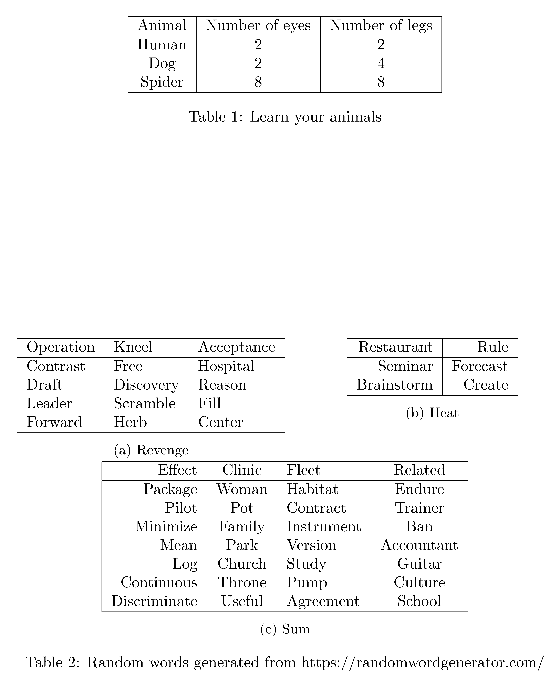

# Notes on Latex

## Contents

- [Notes on Latex](#notes-on-latex)
  - [Contents](#contents)
  - [Installation](#installation)
  - [Useful links](#useful-links)
  - [Compiling a PDF](#compiling-a-pdf)
  - [Compiling to PNG](#compiling-to-png)
  - [Document template](#document-template)
  - [Figures and subfigures](#figures-and-subfigures)
  - [Tables and subtables](#tables-and-subtables)
  - [Description of packages](#description-of-packages)
  - [`.gitignore`](#gitignore)
  - [Changing document style for a particular publication](#changing-document-style-for-a-particular-publication)
  - [Changing colours](#changing-colours)
  - [Maths formatting](#maths-formatting)
    - [Underset text](#underset-text)
  - [Text formatting](#text-formatting)
    - [Use a fixed width font](#use-a-fixed-width-font)

## Installation

Two major distributions of Latex are [TeX Live](https://www.tug.org/texlive/) and [MiKTeX](https://miktex.org/download). [Overleaf appears to suggest MiKTeX for Windows](https://www.overleaf.com/learn/latex/Choosing_a_LaTeX_Compiler#TeX_distributions), however [this Stack Overflow answer states that MiKTeX is susceptible to simple viruses](https://tex.stackexchange.com/a/20415/266921), and TeX Live is also [strongly recommended](https://github.com/James-Yu/LaTeX-Workshop/wiki/Install#requirements) by the [Visual Studio Code LaTeX Workshop Extension](https://github.com/James-Yu/LaTeX-Workshop) (which I am using to automate compiling LaTeX documents into PDF), so I decided to go with TeX Live, which can be downloaded from [here](https://www.tug.org/texlive/).

## Useful links

- ["Learn LaTeX in 30 minutes" on Overleaf](https://www.overleaf.com/learn/latex/Learn_LaTeX_in_30_minutes)
- [CodeCogs equation editor (generates links to equations)](https://editor.codecogs.com/)
  - [Alternative CodeCogs equation editor](https://latex.codecogs.com/eqneditor/editor.php)

## Compiling a PDF

The following code represents an almost-[minimal reproducable example](https://en.wikipedia.org/wiki/Minimal_reproducible_example) of a Latex document (almost in the sense that the `\thispagestyle{empty}` command which removes page numbers is not strictly necessary, although it will produce a nicer looking output when cropped and converted into an image in the next section):

```tex
\documentclass{article}
\thispagestyle{empty}

\begin{document}
Blah blah blah
\end{document}
```

The above code is saved in the file [`latex_mre.tex`](topics/latex/Examples/latex_mre.tex). If this file is open in a VS Code window with the [Visual Studio Code LaTeX Workshop Extension](https://github.com/James-Yu/LaTeX-Workshop) installed, then simply either saving the file or pressing the build button (which looks like a hollow green play button, next to open tabs) will compile the document into a PDF document called `latex_mre.pdf`.

Inspecting the `LaTeX Compiler` option of the VS Code `Output` pane reveals that the command performed when saving the document in VS Code is equivalent to performing the following command (in a terminal open in the directory containing [`latex_mre.tex`](topics/latex/Examples/latex_mre.tex)):

```
pdflatex -synctex=1 -interaction=nonstopmode -file-line-error -recorder latex_mre.tex
```

Descriptions can be found online for the meanings of [`-file-line-error` and `-recorder`](https://linux.die.net/man/1/pdflatex), [`-synctex=1`](https://tex.stackexchange.com/a/118491/266921) and [-interaction=nonstopmode](https://tex.stackexchange.com/a/258816/266921).

Equivalently, this file can be compiled simply using the following command (again, in a terminal open in the directory containing [`latex_mre.tex`](topics/latex/Examples/latex_mre.tex)):

```
pdflatex latex_mre.tex
```

## Compiling to PNG

The file [`latex_mre.tex`](topics/latex/Examples/latex_mre.tex) can be compiled into a PDF, cropped, and then converted into a PNG in Windows using the following Powershell commands (in a terminal open in the directory containing [`latex_mre.tex`](topics/latex/Examples/latex_mre.tex)):

```
pdflatex latex_mre.tex
pdfcrop --margins 10 latex_mre.pdf latex_mre_crop.pdf
$env:GS_LIB="C:/texlive/2022/tlpkg/tlgs/Resource/Init;C:/texlive/2022/tlpkg/tlgs/lib;C:/texlive/2022/tlpkg/tlgs/kanji"
C:/texlive/2022/tlpkg/tlgs/bin/gswin32c.exe -dSAFER -dBATCH -dNOPAUSE -sDEVICE=png16m -r300 -sOutputFile="../Images/latex_mre.png" latex_mre_crop.pdf
```

The resulting image is shown below:


Explanation:

- `pdfcrop` is used to crop `latex_mre.pdf` to remove whitespace, and appears to be installed as part of Tex Live and be on the system path by default
- The `$env:GS_LIB` command only needs to be used once per terminal session, in order to set the `GS_LIB` environment variable, so that `gswin32c` knows where to find the files `gs_init.ps`, `cidfmap`, and `kfwin32.ps` respectively
- The path names in this command as well as the full path of `gswin32c.exe` may need to modified depending on the location of these files in a given installation of Tex Live
- Alternatively (IE instead of setting the `GS_LIB` environment variable) these paths can be included in the `gswin32c.exe` command (without needing to first set any environment variables) by specifying the `-I` flag individually before each path ([source](https://stackoverflow.com/a/12876349/8477566))
- `gswin32c` is a wrapper for the [Ghostscript](https://www.ghostscript.com/index.html) program for converting a PDF to an image file, and appears to be installed as part of Tex Live by default, although its location does not appear on the system path by default (hence it is specified with its full path)
- The double quotes around `../Images/latex_mre.png` appear to be necessary to prevent `gswin32c` returning an error

To change the resolution of the output image, change the value which is provided to the `gswin32c` `-r` flag (300 in the example above), which according to `C:/texlive/2022/tlpkg/tlgs/bin/gswin32c.exe -h` specifies "pixels/inch resolution" (DPI). The equivalent image with 3000 DPI can be produced as follows:

```
C:/texlive/2022/tlpkg/tlgs/bin/gswin32c.exe -dSAFER -dBATCH -dNOPAUSE -sDEVICE=png16m -r3000 -sOutputFile="../Images/latex_mre_3000.png" latex_mre_crop.pdf
```

Below is a side-by-side comparison of the 2 images with different resolutions:


## Document template

The following is a sensible, minimal example of a document template for a `tex` document. It assumes:

- Sections are contained in dedicated `tex` files in a subdirectory called `Sections`
- Images are contained in a parallel directory called `Results`
- References are contained in a file in the current directory called `references.bib`

```latex
\documentclass{article}

\usepackage[a4paper, total={7in, 10in}]{geometry}

\usepackage{hyperref}
\usepackage{amsmath}
\usepackage{amsfonts}
\usepackage{subcaption}
\usepackage{parskip}
\usepackage{xcolor}
\usepackage{graphicx}
\graphicspath{{../Results/}}

\title{
    Main document title \\
    \large Document subtitle
}
\author{Jake Levi \\ University of Oxford}
\date{June 2023}

\begin{document}

\maketitle

\section{Introduction} \label{section:intro}
\input{Sections/Intro.tex}

\section{Related work}
\input{Sections/related_work.tex}

\section{Methods}
\input{Sections/methods.tex}

\section{Results}
\input{Sections/results.tex}

\section{Discussion}
\input{Sections/discussion.tex}

\bibliographystyle{plain}
\bibliography{references}

\appendix

\section{Additional results}\label{appendix:additional results}
\input{Sections/additional_results.tex}

\end{document}
```

## Figures and subfigures

To include figures and subfigures in a Latex document, firstly include the following lines in the preamble, replacing `path/to/image/folder` with the path of the directory containing the images which are to be included, relative to the path of the Latex document (note that the extra pair of curly braces inside `\graphicspath` is necessary for the document to compile, and is not a typographical error):

```tex
\usepackage{subcaption}
\usepackage{graphicx}
\graphicspath{{path/to/image/folder}}
```

Within a document, the following is a template for adding a figure with a single image (IE not including subfigures), in which `example-image` should be replaced with the path (relative to the directory specified in the `graphicspath` command) of the image to be included, and the width, caption and label should be updated appropriately:

```tex
\begin{figure}
    \centering
    \includegraphics[width=0.6\textwidth]{example-image}
    \caption{Example figure}
    \label{fig:example}
\end{figure}
```

Shown below is a template for adding a figure with subfigures. Note that `[t]` after `\begin{subfigure}` is optional, and is used to vertically align the tops of the figures, which is useful when the image captions have different numbers of lines. Other options are `[m]` and `[b]` to align the middles and bottoms of the figures respectively.

```tex
\begin{figure}
    \centering
    \captionsetup[subfigure]{justification=centering}
    \begin{subfigure}[t]{0.45\textwidth}
        \centering
        \includegraphics[width=\textwidth]{example-image-a}
        \caption{Example image A \\ With a caption on multiple lines}
        \label{fig:example A}
    \end{subfigure}
    \hfill
    \begin{subfigure}[t]{0.45\textwidth}
        \centering
        \includegraphics[width=\textwidth]{example-image-b}
        \caption{Example image B}
        \label{fig:example B}
    \end{subfigure}
    \newline
    \begin{subfigure}{0.45\textwidth}
        \centering
        \includegraphics[width=\textwidth]{example-image-c}
        \caption{Example image C}
        \label{fig:example C}
    \end{subfigure}
    \caption{Example figure with subfigures}
    \label{fig:example with subfigures}
\end{figure}
```

These examples are included in the file [`figures.tex`](./Examples/figures.tex), which can be compiled into a PNG with the following commands (assuming a terminal is open in the directory containing [`figures.tex`](./Examples/figures.tex)):

```
pdflatex figures.tex
pdfcrop --margins 10 figures.pdf figures_crop.pdf
$env:GS_LIB="C:/texlive/2022/tlpkg/tlgs/Resource/Init;C:/texlive/2022/tlpkg/tlgs/lib;C:/texlive/2022/tlpkg/tlgs/kanji"
C:/texlive/2022/tlpkg/tlgs/bin/gswin32c.exe -dSAFER -dBATCH -dNOPAUSE -sDEVICE=png16m -r300 -sOutputFile="../Images/figures.png" figures_crop.pdf
```

The resulting image is shown below:


## Tables and subtables

To include subtables in a Latex document, firstly include the following command in the preamble:

```tex
\usepackage{subcaption}
```

Within a document, the following is a template for adding a single table:

```tex
\begin{table}
    \centering
    \begin{tabular}{|c|c|c|}
        \hline
        Animal  & Number of eyes    & Number of legs    \\
        \hline
        Human   & 2                 & 2                 \\
        Dog     & 2                 & 4                 \\
        Spider  & 8                 & 8                 \\
        \hline
    \end{tabular}
    \caption{Learn your animals}
    \label{table:animals}
\end{table}
```

The following is a template for adding multiple subtables:

```tex
\begin{table}
    \centering
    \begin{subtable}[t]{0.5\textwidth}
        \centering
        \begin{tabular}[t]{l l l}
            \hline
            Operation   & Kneel     & Acceptance    \\
            \hline
            Contrast    & Free      & Hospital      \\
            Draft       & Discovery & Reason        \\
            Leader      & Scramble  & Fill          \\
            Forward     & Herb      & Center        \\
            \hline
        \end{tabular}
        \caption{Revenge}
        \label{table:revenge}
    \end{subtable}
    \hfill
    \begin{subtable}[t]{0.45\textwidth}
        \centering
        \begin{tabular}[t]{r|r}
            \hline
            Restaurant  & Rule      \\
            \hline
            Seminar     & Forecast  \\
            Brainstorm  & Create    \\
            \hline
        \end{tabular}
        \caption{Heat}
        \label{table:heat}
    \end{subtable}
    \newline
    \begin{subtable}{\textwidth}
        \centering
        \begin{tabular}{|r c l c|}
            \hline
            Effect          & Clinic    & Fleet         & Related       \\
            \hline
            Package         & Woman     & Habitat       & Endure        \\
            Pilot           & Pot       & Contract      & Trainer       \\
            Minimize        & Family    & Instrument    & Ban           \\
            Mean            & Park      & Version       & Accountant    \\
            Log             & Church    & Study         & Guitar        \\
            Continuous      & Throne    & Pump          & Culture       \\
            Discriminate    & Useful    & Agreement     & School        \\
            \hline
        \end{tabular}
        \caption{Sum}
        \label{table:museum}
    \end{subtable}
    \caption{Random words generated from https://randomwordgenerator.com/}
    \label{table:layout}
\end{table}
```

These examples are included in the file [`tables.tex`](./Examples/tables.tex), which can be compiled into a PNG with the following commands (assuming a terminal is open in the directory containing [`tables.tex`](./Examples/figures.tex)):

```
pdflatex tables.tex
pdfcrop --margins 10 tables.pdf tables_crop.pdf
$env:GS_LIB="C:/texlive/2022/tlpkg/tlgs/Resource/Init;C:/texlive/2022/tlpkg/tlgs/lib;C:/texlive/2022/tlpkg/tlgs/kanji"
C:/texlive/2022/tlpkg/tlgs/bin/gswin32c.exe -dSAFER -dBATCH -dNOPAUSE -sDEVICE=png16m -r300 -sOutputFile="../Images/tables.png" tables_crop.pdf
```

The resulting image is shown below:



## Description of packages

Package name | Description
--- | ---
`geometry`    | *TODO*
`hyperref`    | *TODO*
`amsmath`     | *TODO*
`amsfonts`    | *TODO*
`subcaption`  | *TODO*
`parskip`     | *TODO*
`xcolor`      | *TODO*
`graphicx`    | *TODO*

## `.gitignore`

The following entries can be added to `.gitignore` to ignore the various outputs from `pdflatex`:

```
*.pdf
*.aux
*.fdb_latexmk
*.fls
*.log
*.gz
*.bbl
*.blg
*.out
*.synctex(busy)
```

## Changing document style for a particular publication

- Many academic publications require submissions to be in a particular document style, and publish code online to convert a Latex document into that style
- For example, [ICLR](https://iclr.cc/) publishes [`iclr2023.zip`](https://github.com/ICLR/Master-Template/blob/master/iclr2023.zip) in the [Master-Template](https://github.com/ICLR/Master-Template/tree/master) repository of the [`ICLR`](https://github.com/ICLR) organisation on GitHub
- The 3 most important files in `iclr2023.zip` are `iclr2023_conference.sty` (document style file), `iclr2023_conference.bst` (bibliography style file), and `fancyhdr.sty` (formats document headers)
- To change a Latex document `paper.tex` to fit into the ICLR 2023 template, simply:
  - Make sure that `iclr2023_conference.sty`, `iclr2023_conference.bst` and `fancyhdr.sty` are saved in the same directory as `paper.tex`
  - In `paper.tex`, include the command `\usepackage{iclr2023_conference,times}` immediately after the command `\documentclass{article}`
  - Remove any `geometry` commands (EG `\usepackage[a4paper, total={7in, 10in}]{geometry}`)
  - Remove any `\bibliographystyle` commands (EG `\bibliographystyle{plain}`) and replace them with `\bibliographystyle{iclr2023_conference}` (weirdly, with the [VS Code LaTeX Workshop Extension](https://github.com/James-Yu/LaTeX-Workshop) it might take a couple of tries of building with the specified style files before the build is successful, without any changes to the code between build attemps)
  - Optionally include `\subsubsection*{Author Contributions}` and `\subsubsection*{Acknowledgments}` (followed by relevant content) immediately before the bibliography
- The style files will automatically hide author names and specify "Under review" in the document header
- To reveal author names and change "Under review" to "Published", simply include the command `\iclrfinalcopy` immediately before `\begin{document}`

## Changing colours

Command | Meaning
--- | ---
`\usepackage{xcolor}` | Gain access to colours which can be specified by name (EG `red`, see [Overleaf colour tutorial](https://www.overleaf.com/learn/latex/Using_colours_in_LaTeX#Named_colours_provided_by_the_xcolor_package) for full list of colours and extras)
`\textcolor{red}{Text on one line \\ And another}` | Change text colour to red, with text that runs over multiple lines
`\usepackage{parskip}` | Don't indent the first line of multi-line text (useful for formatting the previous example)
`\colorbox{red}{Text in a red box}` | Create text box with red background (new lines with `\\` have no effect)
`\colorbox{red}{\parbox{5cm}{Text on one line \\ And another}}` | Create text box which has red background, is 5cm wide, and supports new lines with `\\`
`\pagecolor{red}` | Change the page background colour (use after `\begin{document}`)

## Maths formatting

### Underset text

To make text appear underneath an operator, use `\underset`, as in `$\underset{1 \leq j \leq n}{\max}$` (requires `amsmath` package, [source](https://tex.stackexchange.com/a/40217/266921)), EG:


## Text formatting

### Use a fixed width font

Use the `courier` package and `\texttt` command, for example ([source](https://tex.stackexchange.com/a/24848/266921)):

```latex
\documentclass{article}
\usepackage{courier}
\begin{document}

This is not Courier font. \texttt{This is Courier font.}
\end{document}​​​​​​​​​​​​​​​​​​​​​​​​​​​​​​
```
