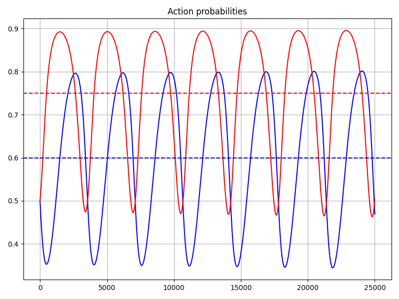

# Notes on PyTorch

## Contents

- [Notes on PyTorch](#notes-on-pytorch)
  - [Contents](#contents)
  - [Installing PyTorch](#installing-pytorch)
  - [Simple automatic differentiation](#simple-automatic-differentiation)
  - [Simple gradient descent](#simple-gradient-descent)
  - [Moving a tensor that requires gradients to a different device](#moving-a-tensor-that-requires-gradients-to-a-different-device)
  - [Using a DataLoader with a custom dataset](#using-a-dataloader-with-a-custom-dataset)
  - [Simple example of training an LSTM](#simple-example-of-training-an-lstm)
  - [Demonstrating periodic naive learning in a 2-player general sum matrix game](#demonstrating-periodic-naive-learning-in-a-2-player-general-sum-matrix-game)

## Installing PyTorch

- Instructions for installing PyTorch can be found [here](https://pytorch.org/get-started/locally/)
- In particular, PyTorch can be downloaded using `pip`
- PyTorch has different versions depending on if the installation is to have both GPU and CPU support or only CPU support, and if the installation is to have GPU support, there are further different versions of PyTorch depending on the version of CUDA
- At the time of writing, the most recent version of CUDA which is supported by a version of PyTorch is CUDA 11.7
- The different versions of CUDA are available to download [here](https://developer.nvidia.com/cuda-toolkit-archive)
- In particular, I downloaded CUDA 11.7.1 (available for download [here](https://developer.nvidia.com/cuda-11-7-1-download-archive))
- During the installation process, the installer states that Visual Studio is required, but doesn't specify which packages within Visual Studio are required
- [This post on the Nvidia developer forum](https://forums.developer.nvidia.com/t/visual-studio-2019-minimal-components-needed-for-cuda-10-installation/81899) suggests that the C++ development workload ("Desktop Development with C++") is "the only one required", however this workload alone requires about 8 GB of storage space
- In the end, I assumed Visual Studio would only be required for CUDA compilation with `nvcc`, but that PyTorch would come with pre-compiled binaries for GPU integration and would only require access to CUDA runtimes and not CUDA compilation, and therefore `nvcc` and by extension Visual Studio wouldn't be required, so I didn't install Visual Studio
- I then installed PyTorch (version `1.13.0+cu117`) with the following commands:

```
python -m pip install -U pip
python -m pip install torch torchvision torchaudio --extra-index-url https://download.pytorch.org/whl/cu117
```

This installation appears to work fine, and commands such as `torch.cuda.is_available()` and `torch.tensor([2.,3,4], requires_grad=True).cuda()` return results suggesting that GPU support is working successfully.

## Simple automatic differentiation

Gradients can be calculated by calling the `backward` method, and should be set to zero (EG by calling `tensor.grad.zero_()`) between gradient calculations to avoid accumulating gradients from previous calculations, for example:

```python
import numpy as np
import torch

w = torch.tensor(np.ones(5), requires_grad=True, dtype=torch.float32)
t = torch.tensor(np.arange(5), requires_grad=False, dtype=torch.float32)

def loss(w, t):
    return torch.sum(torch.square(w - t))

def init_grad(x):
    x.sum().backward()
    zero_grad(x)

def zero_grad(x):
    x.grad.zero_()

def print_tensor(x):
    grad = x.grad.numpy() if (x.grad is not None) else None
    print("%s, grad = %s" % (x.detach().numpy(), grad))

print_tensor(w)
# [1. 1. 1. 1. 1.], grad = None
print_tensor(t)
# [0. 1. 2. 3. 4.], grad = None
init_grad(w)
print_tensor(w)
# [1. 1. 1. 1. 1.], grad = [0. 0. 0. 0. 0.]
loss(w, t).backward()
print_tensor(w)
# [1. 1. 1. 1. 1.], grad = [ 2.  0. -2. -4. -6.]

with torch.no_grad():
    w -= 0.1 * w.grad
print_tensor(w)
# [0.8 1.  1.2 1.4 1.6], grad = [ 2.  0. -2. -4. -6.]
loss(w, t).backward()
print_tensor(w)
# [0.8 1.  1.2 1.4 1.6], grad = [  3.6   0.   -3.6  -7.2 -10.8]
zero_grad(w)
print_tensor(w)
# [0.8 1.  1.2 1.4 1.6], grad = [0. 0. 0. 0. 0.]
loss(w, t).backward()
print_tensor(w)
# [0.8 1.  1.2 1.4 1.6], grad = [ 1.6  0.  -1.6 -3.2 -4.8]
```

Note that `w` is modified in-place within a `torch.no_grad()` context. Trying to modify `w` in-place outside of such a context raises a `RuntimeError`, for example:

```python
import torch
import numpy as np

w = torch.tensor(np.ones(5), requires_grad=True)
w.sum().backward()
w -= w.grad
# RuntimeError: a leaf Variable that requires grad is being used in an in-place operation.
```

## Simple gradient descent

Repeatedly setting gradients to zero, calculating gradients, and updating variables towards the negative gradient direction can be used to define a simple gradient descent loop, for example:

```python
import numpy as np
import torch
import plotting

w = torch.tensor(np.ones(5), requires_grad=True)
t = torch.tensor(np.arange(5), requires_grad=False)

def loss(w, t):
    return torch.sum(torch.square(w - t))

def init_grad(x):
    x.sum().backward()
    zero_grad(x)

def zero_grad(x):
    x.grad.zero_()

init_grad(w)
error_list = []
w_list = [w.detach().clone().numpy()]
print("Starting optimisation loop...")
for i in range(100):
    zero_grad(w)
    e = loss(w, t)
    e.backward()
    with torch.no_grad():
        w -= 5e-2 * w.grad
    error_list.append(e.item())
    w_list.append(w.detach().clone().numpy())

    print("\ri = %i, error = %.5f" % (i, e), end="", flush=True)

print()

plotting.plot(
    plotting.Line(error_list, c="r"),
    plot_name="Error vs iteration",
)
cp = plotting.ColourPicker(5)
line_list = [
    plotting.Line([w[j] for w in w_list], c=cp(j))
    for j in range(5)
]
plotting.plot(*line_list, plot_name="Weights vs iteration")
```


## Moving a tensor that requires gradients to a different device

Given a tensor that requires gradients, if it is copied to a different device using the `Tensor.to` method, the tensor on the new device will propogate gradients back to the original device. To prevent gradients propagating back to the original device, the tensor on the new device must be detached from the computational graph and set to require gradients, EG:

```python
import torch

a = torch.arange(20, dtype=torch.float32).reshape(4, 5)

print(a)
# tensor([[ 0.,  1.,  2.,  3.,  4.],
#         [ 5.,  6.,  7.,  8.,  9.],
#         [10., 11., 12., 13., 14.],
#         [15., 16., 17., 18., 19.]])
a.requires_grad_(True)
print(a)
# tensor([[ 0.,  1.,  2.,  3.,  4.],
#         [ 5.,  6.,  7.,  8.,  9.],
#         [10., 11., 12., 13., 14.],
#         [15., 16., 17., 18., 19.]], requires_grad=True)
a = a.to(device=0)
print(a)
# tensor([[ 0.,  1.,  2.,  3.,  4.],
#         [ 5.,  6.,  7.,  8.,  9.],
#         [10., 11., 12., 13., 14.],
#         [15., 16., 17., 18., 19.]], device='cuda:0', grad_fn=<ToCopyBackward0>)
a.detach_().requires_grad_(True)
print(a)
# tensor([[ 0.,  1.,  2.,  3.,  4.],
#         [ 5.,  6.,  7.,  8.,  9.],
#         [10., 11., 12., 13., 14.],
#         [15., 16., 17., 18., 19.]], device='cuda:0', requires_grad=True)
```

## Using a DataLoader with a custom dataset

To use a `DataLoader` with a custom dataset, define a class for the dataset which is a subclass of `torch.utils.data.Dataset` ([source](https://pytorch.org/tutorials/beginner/basics/data_tutorial.html#creating-a-custom-dataset-for-your-files)), and implement the following methods:

Method name | Purpose | When it is called
--- | --- | ---
`__init__` | Initialise the dataset, including any necessary attributes used by `__len__` and `__getitem__` | When the dataset is initialised
`__len__` | Return the total number of datapoints in the dataset | Called by a `DataLoader`, with frequency that depends on if the `DataLoader` is initialised with `shuffle` equal to  `True` or `False`. If `shuffle` is `False`, `__len__` is called once at the start of each epoch. If `shuffle` is `True`, `__len__` is called twice when the `DataLoader` is initialised, and 3 times per epoch (twice at the start of the epoch, and once before or after the final batch, depending on if the number of data points is a multiple of the batch size)
`__getitem__` | Return a single data point (input and target) with the given index | Called by a `DataLoader` once for every datapoint in every batch (IE `batch_size` number of times per batch)

Below is a toy example:

```python
import torch
import numpy as np

class MockData(torch.utils.data.Dataset):
    def __init__(self, n=8):
        self._n = n
        self._x = np.arange(n)
        self._y = self._x + 100

    def __len__(self):
        print("Called len(MockData)")
        return self._n

    def __getitem__(self, index):
        print("Called MockData[%i]" % index)
        return self._x[index], self._y[index]

dataset = MockData()
data_loader = torch.utils.data.DataLoader(
    dataset=dataset,
    batch_size=3,
    shuffle=True,
)
for epoch in range(2):
    print("Epoch = %i" % epoch)
    for x, y in data_loader:
        print("Received batch x = %s, y = %s" % (x, y))
```

Output:

```
Called len(MockData)
Called len(MockData)
Epoch = 0
Called len(MockData)
Called len(MockData)
Called MockData[6]
Called MockData[1]
Called MockData[0]
Received batch x = tensor([6, 1, 0], dtype=torch.int32), y = tensor([106, 101, 100], dtype=torch.int32)
Called MockData[7]
Called MockData[5]
Called MockData[2]
Received batch x = tensor([7, 5, 2], dtype=torch.int32), y = tensor([107, 105, 102], dtype=torch.int32)
Called len(MockData)
Called MockData[4]
Called MockData[3]
Received batch x = tensor([4, 3], dtype=torch.int32), y = tensor([104, 103], dtype=torch.int32)
Epoch = 1
Called len(MockData)
Called len(MockData)
Called MockData[7]
Called MockData[1]
Called MockData[3]
Received batch x = tensor([7, 1, 3], dtype=torch.int32), y = tensor([107, 101, 103], dtype=torch.int32)
Called MockData[0]
Called MockData[2]
Called MockData[5]
Received batch x = tensor([0, 2, 5], dtype=torch.int32), y = tensor([100, 102, 105], dtype=torch.int32)
Called len(MockData)
Called MockData[6]
Called MockData[4]
Received batch x = tensor([6, 4], dtype=torch.int32), y = tensor([106, 104], dtype=torch.int32)
```

## Simple example of training an LSTM

- The following code trains a 2-layer LSTM with 256 hidden units per layer followed by a single linear output layer to predict the next data point in a sequence given the current and previous data points in the sequence
- The model is trained on a simple 1-dimensional sinusoidal dataset with 100 different sequences, each 100 time steps long, of frequencies ranging from between 1 to 2 Hz (and with a sampling rate of 100 Hz)
- The training loop of 200 epochs takes > 3.5 minutes on a Intel(R) Core(TM) i7-1065G7 CPU @ 1.30GHz, and < 19 seconds on a NVIDIA GeForce MX250 GPU, a speed-up factor of > 11
- The training curve is shown below
- After training, a predictive sequence is rolled out (given a single initial data point), which is also shown below, and looks reasonably similar to a sinusoidal curve, which is encouraging
- Note that replacing `torch.nn.LSTM` with `torch.nn.GRU` in the code below achieves a loss of 0.00015 in 16.0896s, compared to 0.00023 in 18.9291s with an LSTM
  - The GRU achieves a significantly better loss in less time with the same architecture, implying that in this case, the GRU is a better option than an LSTM

```python
import numpy as np
import torch

torch.manual_seed(0)

seq_len = 100
batch_size = 100
t = torch.linspace(0, 1, seq_len, device=0).reshape(1, seq_len, 1)
f = torch.linspace(1, 2, batch_size, device=0).reshape(batch_size, 1, 1)
x = torch.sin(2 * np.pi * f * t)

lstm = torch.nn.LSTM(
    input_size=1,
    hidden_size=256,
    num_layers=2,
    device=0,
    batch_first=True,
)
linear = torch.nn.Linear(256, 1, device=0)
optimiser = torch.optim.Adam(
    list(lstm.parameters()) +
    list(linear.parameters())
)
mse = torch.nn.MSELoss()

table = util.Table(
    util.Column("iteration"),
    util.Column("loss", value_format=".5f", width=10),
    util.TimeColumn("t"),
    print_every=10,
)

for i in range(200):
    h, _ = lstm(x[:, :-1])
    y = linear(h)
    optimiser.zero_grad()
    loss = mse(y, x[:, 1:])
    loss.backward()
    optimiser.step()
    table.update(iteration=i, loss=loss.item())

table.update()
plotting.plot(
    plotting.Line(table.get_data("loss"), c="b"),
    axis_properties=plotting.AxisProperties("Epoch", "MSE", log_yscale=True),
    plot_name="Learning curve",
)

y_0 = torch.zeros([1, 1, 1], device=0)
h, state = lstm(y_0)
y = linear(h)
y_list = [y_0.item(), y.item()]
for _ in range(400):
    h, state = lstm(y, state)
    y = linear(h)
    y_list.append(y.item())

plotting.plot(plotting.Line(y_list, c="b"), plot_name="Rollout")
```


## Demonstrating periodic naive learning in a 2-player general sum matrix game

```python
import torch

r0 = torch.tensor([[3, 1], [2, 4]], dtype=torch.float32)
r1 = torch.tensor([[1, 3], [5, 2]], dtype=torch.float32)
print(r0, r1, sep="\n")

a0 = torch.tensor(0, dtype=torch.float32).requires_grad_(True)
a1 = torch.tensor(0, dtype=torch.float32).requires_grad_(True)
a0.sum().backward()
a1.sum().backward()
def zero_grad():
    a0.grad.zero_()
    a1.grad.zero_()

zero_grad()
table = util.Table(
    util.Column("iteration", width=10),
    util.Column("p", ".3f", width=10),
    util.Column("q", ".3f", width=10),
    util.Column("r0", ".3f", width=10),
    util.Column("r1", ".3f", width=10),
    util.TimeColumn("t"),
    print_every=1000,
)
for i in range(25000):
    p = torch.stack([torch.sigmoid(a0), 1 - torch.sigmoid(a0)]).reshape(2, 1)
    q = torch.stack([torch.sigmoid(a1), 1 - torch.sigmoid(a1)]).reshape(2, 1)
    reward_0 = p.T @ r0 @ q.detach()
    reward_1 = p.T.detach() @ r1 @ q
    zero_grad()
    reward_0.backward()
    reward_1.backward()
    with torch.no_grad():
        a0 += 1e-2 * a0.grad
        a1 += 1e-2 * a1.grad

    table.update(
        iteration=i,
        p=torch.sigmoid(a0).item(),
        q=torch.sigmoid(a1).item(),
        r0=reward_0.item(),
        r1=reward_1.item(),
    )

plotting.plot(
    plotting.Line(table.get_data("p"), c="b"),
    plotting.Line(table.get_data("q"), c="r"),
    plot_name="Action probabilities",
)
plotting.plot(
    plotting.Line(table.get_data("r0"), c="b"),
    plotting.Line(table.get_data("r1"), c="r"),
    plot_name="Expected payoffs",
)
```




