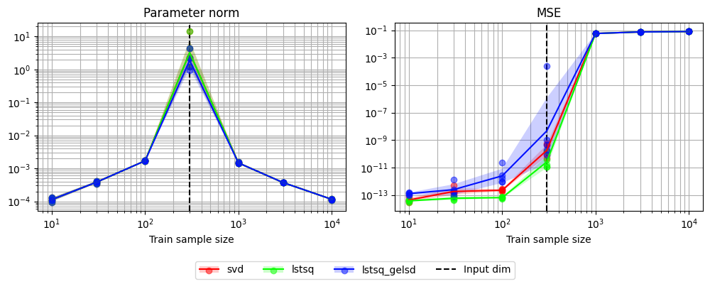
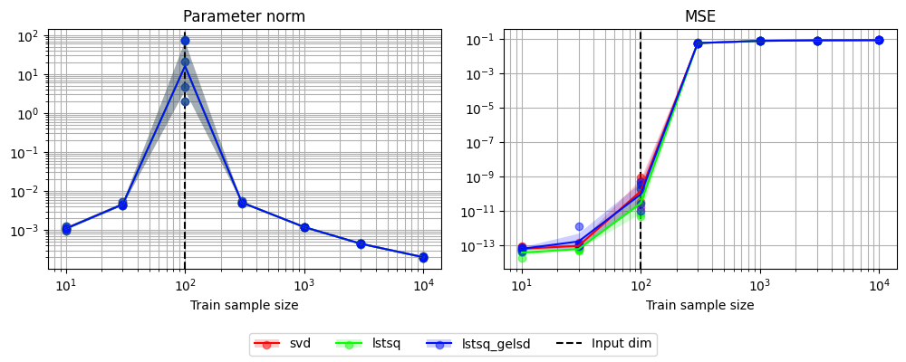
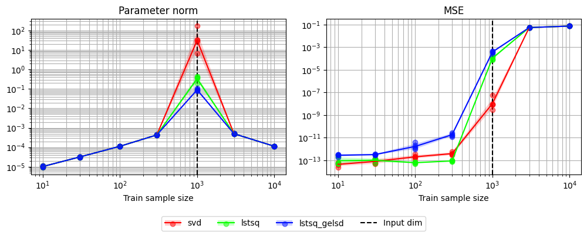

# `topics/pytorch/scripts/README.md`

## Contents

- [`topics/pytorch/scripts/README.md`](#topicspytorchscriptsreadmemd)
  - [Contents](#contents)
  - [`topics/pytorch/scripts/demo_double_descent.py`](#topicspytorchscriptsdemo_double_descentpy)

## `topics/pytorch/scripts/demo_double_descent.py`

```sh
python topics/pytorch/scripts/demo_double_descent.py
# Time taken for `main` = 7.3201 seconds
```



```sh
python topics/pytorch/scripts/demo_double_descent.py --input_dim 100
# Time taken for `main` = 20.0856 seconds
```



```sh
python topics/pytorch/scripts/demo_double_descent.py --input_dim 1000
# Time taken for `main` = 16.4307 seconds
```


