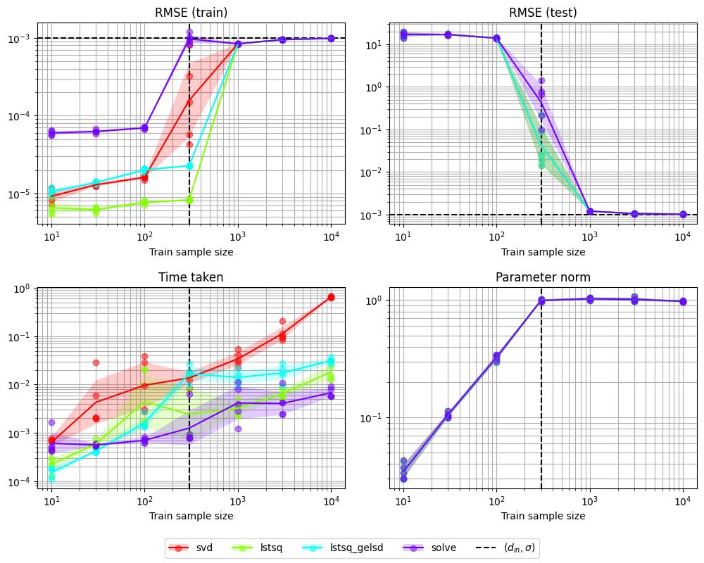
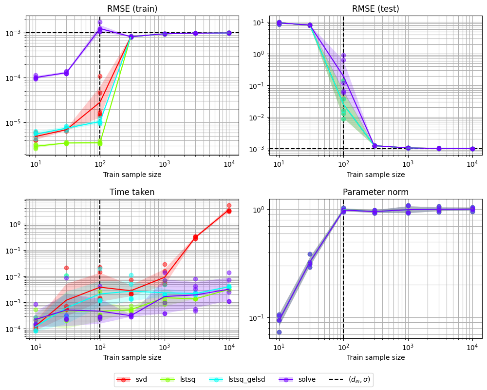
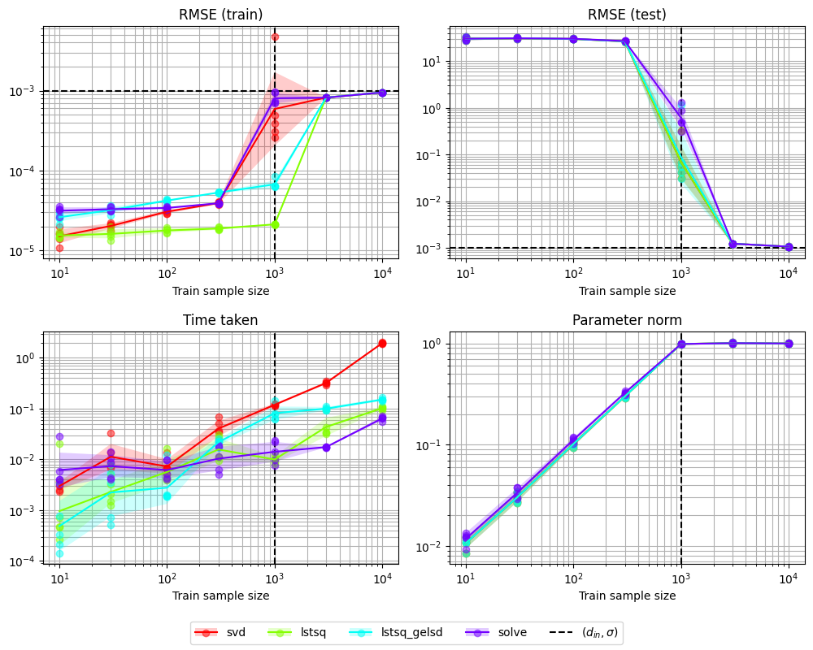
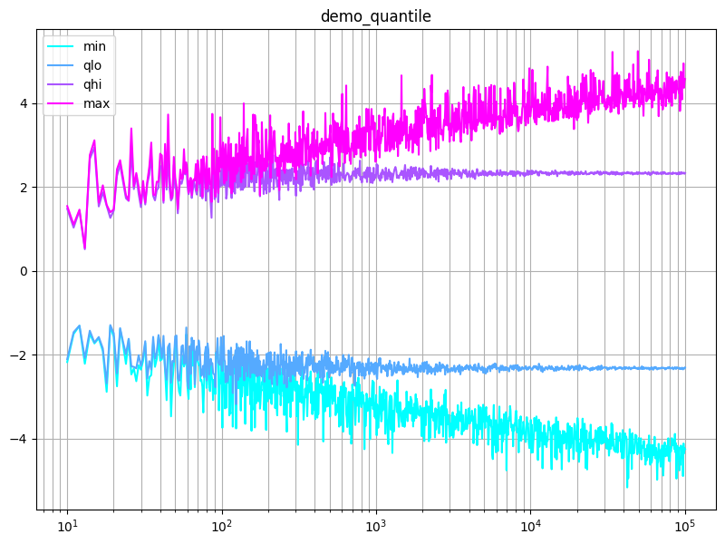
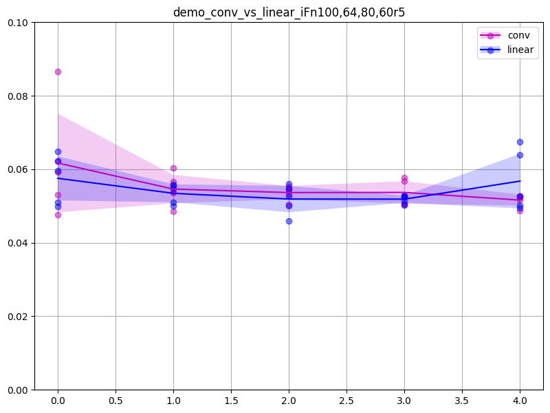
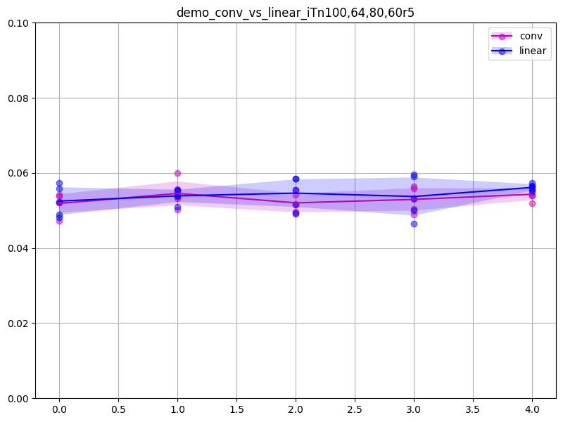

# `topics/pytorch/scripts/README.md`

## Contents

- [`topics/pytorch/scripts/README.md`](#topicspytorchscriptsreadmemd)
  - [Contents](#contents)
  - [`topics/pytorch/scripts/demo_double_descent.py`](#topicspytorchscriptsdemo_double_descentpy)
  - [`topics/pytorch/scripts/demo_quantile.py`](#topicspytorchscriptsdemo_quantilepy)
  - [`topics/pytorch/scripts/demo_conv_vs_linear.py`](#topicspytorchscriptsdemo_conv_vs_linearpy)

## `topics/pytorch/scripts/demo_double_descent.py`

```sh
python topics/pytorch/scripts/demo_double_descent.py
# Time taken for `main` = 6.8436 seconds
```



```sh
python topics/pytorch/scripts/demo_double_descent.py --input_dim 100
# Time taken for `main` = 21.5127 seconds
```



```sh
python topics/pytorch/scripts/demo_double_descent.py --input_dim 1000
# Time taken for `main` = 18.2575 seconds
```



## `topics/pytorch/scripts/demo_quantile.py`

```
topics/pytorch/scripts/demo_quantile.py
```



## `topics/pytorch/scripts/demo_conv_vs_linear.py`

```
python topics/pytorch/scripts/demo_conv_vs_linear.py
```


```
python topics/pytorch/scripts/demo_conv_vs_linear.py --include_reshape
```


