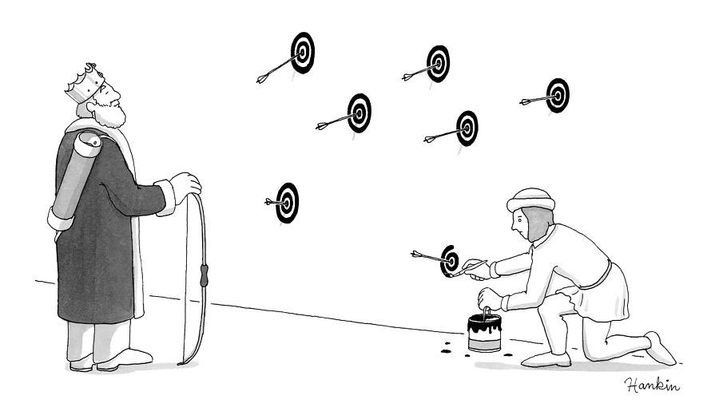

# Quotes

*"Whoever, in the pursuit of science, seeks after immediate practical utility may rest assured that he seeks in vain."*

> Hermann von Helmholtz

---

*"Man's power appears to have increased out of all proportion to his wisdom"*

> B F Skinner, 1953, "Science and Human Behavior"

---

*"He doesn't want to know about rhodopsin, or the lateral geniculate nucleus, or inhibitory interneurons. He wants to know how to program vision."*

> David Marr, 1982, "Vision"

---

*"I do not particularly want to go where the money is - it usually does not smell nice there."*

> A. Stepanov, interview with Graziano Lo Russo ([source](http://stlport.org/resources/StepanovUSA.html), cited [here](https://isocpp.org/wiki/faq/basics-of-inheritance))

---

*"What's really going on?"*

> [Danny Shine](https://www.youtube.com/watch?v=UHnyRRpgVFc)

---

*"If you can meet with Triumph and Disaster And treat those two impostors just the same... If you can fill the unforgiving minute With sixty seconds' worth of distance run, Yours is the Earth and everything that's in it"*

> Rudyard Kipling, "If—"

---

*"the ducks at the park are free you can take them home"*

> [@weinerdog4life, 2018](https://x.com/weinerdog4life/status/992289990083166210)

---

*"I really like depriving myself of things. It's fun. Very monastic"*

> [Cosmo Kramer - S06E07 "The Soup", Seinfeld, 1994](https://www.seinfeldscripts.com/TheSoup.html)

---

*"Mileage makes champions"*

> [Steve Fairbairn](https://en.wikipedia.org/wiki/Steve_Fairbairn)

---

*"I found an insurmountable aversion to every thing but the pursuits of philosophy and general learning; and while they fancied I was poring upon [Voet](https://en.wikipedia.org/wiki/Johannes_Voet) and [Vinius](https://en.wikipedia.org/wiki/Arnold_Vinnius), [Cicero](https://en.wikipedia.org/wiki/Cicero) and [Virgil](https://en.wikipedia.org/wiki/Virgil) were the authors which I was secretly devouring."*

> [David Hume (1711 - 1776)](https://en.wikipedia.org/wiki/David_Hume), [My Own Life](https://web.archive.org/web/20180116061536/http://andromeda.rutgers.edu/~jlynch/Texts/humelife.html), from [The History of England (1778)](https://en.wikipedia.org/wiki/The_History_of_England_(Hume_book))

---

*"If you crave to prove your beloved hypothesis, you'll always find a way to do so - and you'll *almost* always be wrong."*

> [@AdrianoAguzzi](https://x.com/AdrianoAguzzi), [4:39 PM, Apr 11, 2025](https://x.com/AdrianoAguzzi/status/1910719311586488791). See also attached [picture](img/hypothesis.png):
>
> 

---

*"There is no hippopotamus in this room at present."*

> [Bertrand Russell](https://en.wikipedia.org/wiki/Bertrand_Russell), [addressed](https://en.wikipedia.org/wiki/Ludwig_Wittgenstein#Arrival_at_Cambridge) to [22-year-old](https://www.basicincome.com/bp/probablythetwo.htm) [Ludwig Wittgenstein
](https://en.wikipedia.org/wiki/Ludwig_Wittgenstein), whose response "nothing empirical is knowable" [has been connected](https://philosophy.stackexchange.com/a/41416/94293) to "David Hume and the problem of induction":
>
> > *When e.g. Russell looked under one table, it is perfectly possible (that is, logically possible) that the rhinoceros popped up under the other table, and vice versa. The rhinoceros could have been on the ceiling, it could have been very small, it could have been invisible, etc. There would be no way to know otherwise.*

---
